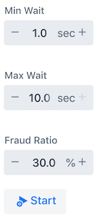

## Credit Card Transaction Data Generator

Standalone application that can continuously generate data records compliant with the the data format specified in [Credit Card Fraud Detection](https://www.kaggle.com/mlg-ulb/creditcardfraud) - Anonymized credit card transactions labeled as fraudulent or genuine.

The data records are generated in random intervals and pushed into a pre-configured Database.  

#### Data Format
On start it creates the following `credit_card_transaction` table: 

```sql
CREATE SCHEMA cdc;
  
CREATE TABLE credit_card_transaction (
  time   FLOAT,
  v1     FLOAT,
  v2     FLOAT,
  v3     FLOAT,
  v4     FLOAT,
  v5     FLOAT,
  v6     FLOAT,
  v7     FLOAT,
  v8     FLOAT,
  v9     FLOAT,
  v10    FLOAT,
  v11    FLOAT,
  v12    FLOAT,
  v13    FLOAT,
  v14    FLOAT,
  v15    FLOAT,
  v16    FLOAT,
  v17    FLOAT,
  v18    FLOAT,
  v19    FLOAT,
  v20    FLOAT,
  v21    FLOAT,
  v22    FLOAT,
  v23    FLOAT,
  v24    FLOAT,
  v25    FLOAT,
  v26    FLOAT,
  v27    FLOAT,
  v28    FLOAT,
  amount FLOAT
);
```

The column names and types match the `Credit Card Fraud Detection` [dataset format](https://www.kaggle.com/mlg-ulb/creditcardfraud).

NOTE: The `Class` feature is intentionally dropped as it represents the `fraud` or `non-fraud` (e.g. normal) label used for training the ML model.

> For confidentiality reasons the values of most of the original features, such as `V1`, `V2`, ... `V28` have been anonymized using a principal components obtained with PCA. 

> The only features which have not been transformed with PCA are `Time` and `Amount`. 
> Feature `Time` contains the seconds elapsed between each transaction and the first transaction in the dataset. 
> The feature `Amount` is the transaction amount. 


#### Configuration

To connect to the target Database use the common [Spring connection properties](https://docs.spring.io/spring-boot/docs/current/reference/html/boot-features-sql.html#boot-features-connect-to-production-database): 

```properties
spring.datasource.driver-class-name=org.postgresql.Driver
spring.datasource.url=jdbc:postgresql://localhost:5432/postgres
spring.datasource.username=postgres
spring.datasource.password=postgres
```

By default the generator runs at http://localhost:8080/generator . 
Use the `server.port` property to alter the default port.

The `credit.card.transaction.generator.drop-schema` property (`true` by default) disables the automatic schema re-creation on start.

In some use cases, such as docker container configuration one can opt for the environment variable equivalent instead:
```properties
SPRING_DATASOURCE_URL=jdbc:postgresql://postgres-cdc:5432/postgres
SPRING_DATASOURCE_USERNAME=postgres
SPRING_DATASOURCE_PASSWORD=postgres
SPRING_DATASOURCE_DRIVER_CLASS_NAME=org.postgresql.Driver
``` 

#### UI Control 
Simple web panel allows to control the generation rate and the ration between Fraud and Norma transaction.

By default the control panel is accessible at http://localhost:8080/generator and looks like this:
 


* `Start/Stop` button to initiate or stop the generation. 
* `Fraud Ration` controls the amount of fraud vs normal records generated.
* Wait a random interval (`Min`, `Max`) in seconds between two consecutive record generations.

#### Build

Build jar and docker image:
```
./mvnw clean install docker:build
```
produces and boot `credit-card-transaction-generator-0.0.1-SNAPSHOT.jar` and a docker images `tzolov/credit-card-transaction-generator:0.0.1-SNAPSHOT`

Publish docker image to DockerHub:
```
./mvnw  docker:push
```

#### Testing

Start local Postgres:
```bash
docker run -it --rm --name postgres -p 5432:5432 -e POSTGRES_USER=postgres -e POSTGRES_PASSWORD=postgres debezium/example-postgres:0.10
```

You can connect to the postgres server using password: `postgres`:
```
psql -U postgres -h localhost -p 5432
```

list schemas, tables and table content:
```sql
\dn
\dt cdc.*
select count(*) from cdc.credit_card_transaction;
```

manually insert a Fraud record:
```sql
INSERT INTO cdc.credit_card_transaction(time,v1,v2,v3 ,v4,v5,v6 ,v7 ,v8 ,v9 ,v10,v11,v12,v13,v14,v15,v16,v17,v18,v19,v20,v21,v22,v23,v24,v25,v26,v27,v28,amount) 
VALUES(406,-2.3122265423263,1.95199201064158,-1.60985073229769,3.9979055875468,-0.522187864667764,-1.42654531920595,-2.53738730624579,1.39165724829804,-2.77008927719433,-2.77227214465915,3.20203320709635,-2.89990738849473,-0.595221881324605,-4.28925378244217,0.389724120274487,-1.14074717980657,-2.83005567450437,-0.0168224681808257,0.416955705037907,0.126910559061474,0.517232370861764,-0.0350493686052974,-0.465211076182388,0.320198198514526,0.0445191674731724,0.177839798284401,0.261145002567677,-0.143275874698919,0);
```
or normal record: 
```sql
INSERT INTO cdc.credit_card_transaction(time,v1,v2,v3 ,v4,v5,v6 ,v7 ,v8 ,v9 ,v10,v11,v12,v13,v14,v15,v16,v17,v18,v19,v20,v21,v22,v23,v24,v25,v26,v27,v28,amount)
VALUES(0,-1.3598071336738,-0.0727811733098497,2.53634673796914,1.37815522427443,-0.338320769942518,0.462387777762292,0.239598554061257,0.0986979012610507,0.363786969611213,0.0907941719789316,-0.551599533260813,-0.617800855762348,-0.991389847235408,-0.311169353699879,1.46817697209427,-0.470400525259478,0.207971241929242,0.0257905801985591,0.403992960255733,0.251412098239705,-0.018306777944153,0.277837575558899,-0.110473910188767,0.0669280749146731,0.128539358273528,-0.189114843888824,0.133558376740387,-0.0210530534538215,149.62);
```

